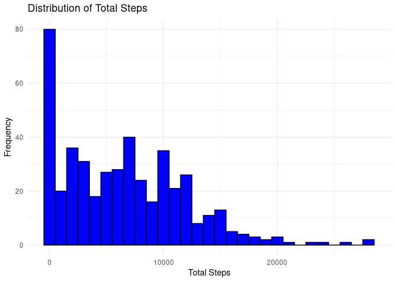
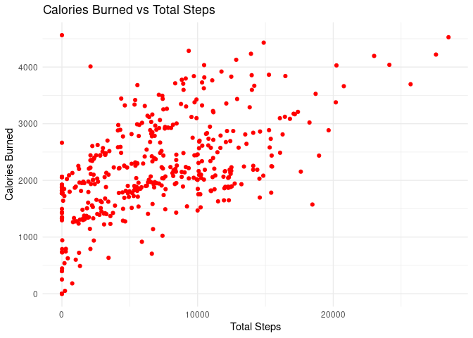
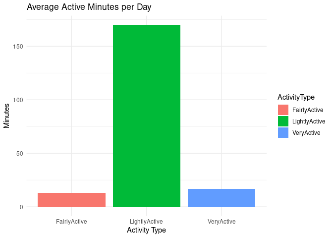
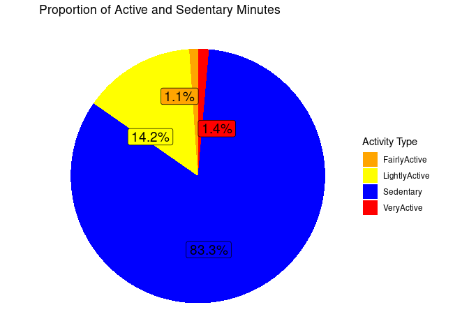
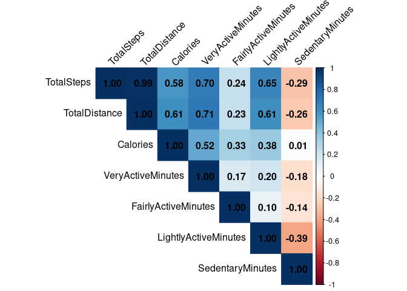
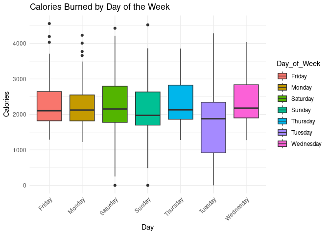

Capstone_Project_2
================
2024-10-08

## Ask Phase

###### Objectives

1.  What are some trends in smart device usage?
2.  How could these trends apply to Bellabeat customers?
3.  How could these trends help influence Bellabeat marketing strategy?

###### Deliverables

1.  A clear summary of the **business task**
2.  A description of all **data sources** used
3.  Documentation of any **cleaning** or manipulation of data
4.  A **summary** of your analysis
5.  Supporting **visualizations** and **key findings**
6.  Your top high-level content **recommendations** based on your
    analysis

###### Background Information

Bellabeat is a high-tech manufacturer of beautifully-designed
health-focused smart products for women since 2013. Inspiring and
empowering women with knowledge about their own health and habits,
Bellabeat has grown rapidly and quickly positioned itself as a
tech-driven wellness company for females.

###### Problem

The company wants me to find trends in the data from people using their
smart devices, more specifically their fitness tracker. So, what these
trends are, the implication for the customer in terms of data insights
for their health based on the tracker performance, and which trends will
be useful for marketing the product further.

###### Business Task

Produce a report detailing the key trends from the fitness trackers from
users and identify what the trends mean for the customers, and thus how
they inform the marketing strategy for Bellabeat.

###### Key Stakeholders

- Urška Sršen: Bellabeat’s cofounder and Chief Creative Officer
- Sando Mur: Mathematician, Bellabeat’s cofounder and key member of the
  Bellabeat executive team
- Bellabeat marketing analytics team: A team of data analysts guiding
  Bellabeat’s marketing strategy.

## Prepare

###### Data Storage and Info

- The data is available to the public at [FitBit Fitness Tracker Data
  (kaggle.com)](https://www.kaggle.com/datasets/arashnic/fitbit/data)
  and is stored in a total of 18 .csv files
- Generated by between 12 March 2016 to 12 May 2016 from a distributed
  survey via Amazon Mechanical Turk between .
- 30 Fitbit users consented to have their data used
- Key data collected as part of this study
  - Steps
  - Physical Activity
  - Heart rate
  - Sleep
- Wide format of data

###### Data Credibility

- Reliability: Not so great due to small population sample
- Originality: Also not great as this is through a third party provider
- Comprehensive: This is a bit better, as the information is useful,
  plentiful and aligns with the customer need
- Current: The data is older than is a appropriate
- Cited: Again, through a third party, which isn’t as useful
- Additionally: The data is licensed as ‘CC0: Public Domain’ which
  useful for this study, and makes it more reliable

###### Limitations

- Small sample size of 30 females is not ideal, and may not be
  representative
- Data was collected in 2016, which may make it less credible in some
  senses, and situation changes may alter the readings
- Not being fully involved with the company, means certain questions
  cannot be asked, so there may be gaps in information leading to less
  integrity.
- The credibility summary highlights the data is not appropriate for a
  business case use

###### Study Focus

This study will focus on the *dailyActivity_merged* file from version
3.12.16-4.11.16 with potential for study into further datasets with more
time resources.

## Processing Phase with Excel

- =TEXT(B2:B458, “dd/mm/yyyy”)
- To change any date value to the general format so that no serial
  numbers are present
- The new file created is then imported for the main processing below

###### Pre-processing

###### Importing Packages

``` r
install.packages("readxl")
```

    ## Installing package into '/cloud/lib/x86_64-pc-linux-gnu-library/4.4'
    ## (as 'lib' is unspecified)

``` r
install.packages("ggplot2")
```

    ## Installing package into '/cloud/lib/x86_64-pc-linux-gnu-library/4.4'
    ## (as 'lib' is unspecified)

``` r
install.packages("dplyr")
```

    ## Installing package into '/cloud/lib/x86_64-pc-linux-gnu-library/4.4'
    ## (as 'lib' is unspecified)

``` r
install.packages("tidyr")
```

    ## Installing package into '/cloud/lib/x86_64-pc-linux-gnu-library/4.4'
    ## (as 'lib' is unspecified)

``` r
install.packages("corrplot")
```

    ## Installing package into '/cloud/lib/x86_64-pc-linux-gnu-library/4.4'
    ## (as 'lib' is unspecified)

``` r
install.packages("ggrepel")
```

    ## Installing package into '/cloud/lib/x86_64-pc-linux-gnu-library/4.4'
    ## (as 'lib' is unspecified)

``` r
library(readxl)
library(ggplot2)
library(dplyr)
```

    ## 
    ## Attaching package: 'dplyr'

    ## The following objects are masked from 'package:stats':
    ## 
    ##     filter, lag

    ## The following objects are masked from 'package:base':
    ## 
    ##     intersect, setdiff, setequal, union

``` r
library(tidyr)
library(corrplot)
```

    ## corrplot 0.94 loaded

``` r
library(ggrepel)
```

###### Importing Data

``` r
data <- read_excel("Capstone.xlsx", sheet = 1)
```

###### Overview of data

``` r
head(data)
```

    ## # A tibble: 6 × 15
    ##           Id ActivityDate TotalSteps TotalDistance TrackerDistance
    ##        <dbl> <chr>             <dbl>         <dbl>           <dbl>
    ## 1 1503960366 3/31/2016         12256          7.86            7.86
    ## 2 1503960366 3/30/2016         10970          7.16            7.16
    ## 3 1503960366 3/29/2016         12041          7.85            7.85
    ## 4 1503960366 3/28/2016         13231          8.93            8.93
    ## 5 1503960366 3/27/2016         12736          8.53            8.53
    ## 6 1503960366 3/26/2016         17609         11.6            11.6 
    ## # ℹ 10 more variables: LoggedActivitiesDistance <dbl>,
    ## #   VeryActiveDistance <dbl>, ModeratelyActiveDistance <dbl>,
    ## #   LightActiveDistance <dbl>, SedentaryActiveDistance <dbl>,
    ## #   VeryActiveMinutes <dbl>, FairlyActiveMinutes <dbl>,
    ## #   LightlyActiveMinutes <dbl>, SedentaryMinutes <dbl>, Calories <dbl>

###### Check for missing values

``` r
missing_data <- colSums(is.na(data))
print(missing_data)
```

    ##                       Id             ActivityDate               TotalSteps 
    ##                        0                        0                        0 
    ##            TotalDistance          TrackerDistance LoggedActivitiesDistance 
    ##                        0                        0                        0 
    ##       VeryActiveDistance ModeratelyActiveDistance      LightActiveDistance 
    ##                        0                        0                        0 
    ##  SedentaryActiveDistance        VeryActiveMinutes      FairlyActiveMinutes 
    ##                        0                        0                        0 
    ##     LightlyActiveMinutes         SedentaryMinutes                 Calories 
    ##                        0                        0                        0

###### Find out about data types

``` r
glimpse(data)
```

    ## Rows: 457
    ## Columns: 15
    ## $ Id                       <dbl> 1503960366, 1503960366, 1503960366, 150396036…
    ## $ ActivityDate             <chr> "3/31/2016", "3/30/2016", "3/29/2016", "3/28/…
    ## $ TotalSteps               <dbl> 12256, 10970, 12041, 13231, 12736, 17609, 110…
    ## $ TotalDistance            <dbl> 7.86, 7.16, 7.85, 8.93, 8.53, 11.55, 7.11, 0.…
    ## $ TrackerDistance          <dbl> 7.86, 7.16, 7.85, 8.93, 8.53, 11.55, 7.11, 0.…
    ## $ LoggedActivitiesDistance <dbl> 0, 0, 0, 0, 0, 0, 0, 0, 0, 0, 0, 0, 0, 0, 0, …
    ## $ VeryActiveDistance       <dbl> 2.29, 2.36, 2.16, 3.19, 4.66, 6.92, 2.57, 0.0…
    ## $ ModeratelyActiveDistance <dbl> 0.49, 0.51, 1.09, 0.79, 0.16, 0.73, 0.46, 0.0…
    ## $ LightActiveDistance      <dbl> 5.04, 4.29, 4.61, 4.95, 3.71, 3.91, 4.07, 0.1…
    ## $ SedentaryActiveDistance  <dbl> 0.00, 0.00, 0.00, 0.00, 0.00, 0.00, 0.00, 0.0…
    ## $ VeryActiveMinutes        <dbl> 33, 30, 28, 39, 56, 89, 33, 0, 26, 44, 32, 46…
    ## $ FairlyActiveMinutes      <dbl> 12, 13, 28, 20, 5, 17, 12, 0, 14, 13, 15, 22,…
    ## $ LightlyActiveMinutes     <dbl> 239, 223, 243, 224, 268, 274, 205, 9, 216, 16…
    ## $ SedentaryMinutes         <dbl> 820, 1174, 763, 1080, 605, 588, 804, 32, 855,…
    ## $ Calories                 <dbl> 1889, 1820, 1886, 1932, 1944, 2154, 1819, 50,…

###### Ensure the number of respondents is correct:

- Show all unique Id values
- Show number of unique Id’s
- Show number of entries per unique id
- Show total number of entries

``` r
unique_values <- unique(data$Id)
print(unique_values)
```

    ##  [1] 1503960366 1624580081 1644430081 1844505072 1927972279 2022484408
    ##  [7] 2026352035 2320127002 2347167796 2873212765 2891001357 3372868164
    ## [13] 3977333714 4020332650 4057192912 4319703577 4388161847 4445114986
    ## [19] 4558609924 4702921684 5553957443 5577150313 6117666160 6290855005
    ## [25] 6391747486 6775888955 6962181067 7007744171 7086361926 8053475328
    ## [31] 8253242879 8378563200 8583815059 8792009665 8877689391

``` r
num_unique <- length(unique_values)
print(num_unique)
```

    ## [1] 35

``` r
value_counts <- table(data$Id)
print(value_counts)
```

    ## 
    ## 1503960366 1624580081 1644430081 1844505072 1927972279 2022484408 2026352035 
    ##         19         19         10         12         12         12         12 
    ## 2320127002 2347167796 2873212765 2891001357 3372868164 3977333714 4020332650 
    ##         12         15         12          8         10         12         32 
    ## 4057192912 4319703577 4388161847 4445114986 4558609924 4702921684 5553957443 
    ##         32         12          8         15         12         15         12 
    ## 5577150313 6117666160 6290855005 6391747486 6775888955 6962181067 7007744171 
    ##         11         10         10          9          9         14         12 
    ## 7086361926 8053475328 8253242879 8378563200 8583815059 8792009665 8877689391 
    ##         12         11         12         12          8         12         12

``` r
total_entries <- length(data$Id)
print(total_entries)
```

    ## [1] 457

###### Checking for distance match

According to the survey data, the total distance should be calculable by
adding the tracker distance data and the logged activities data: \*
Boolean representing match \* Count for how many are true and how many
are false

``` r
data$Distance_Match <- data$TotalDistance == (data$TrackerDistance + data$LoggedActivitiesDistance)
head(data)
```

    ## # A tibble: 6 × 16
    ##           Id ActivityDate TotalSteps TotalDistance TrackerDistance
    ##        <dbl> <chr>             <dbl>         <dbl>           <dbl>
    ## 1 1503960366 3/31/2016         12256          7.86            7.86
    ## 2 1503960366 3/30/2016         10970          7.16            7.16
    ## 3 1503960366 3/29/2016         12041          7.85            7.85
    ## 4 1503960366 3/28/2016         13231          8.93            8.93
    ## 5 1503960366 3/27/2016         12736          8.53            8.53
    ## 6 1503960366 3/26/2016         17609         11.6            11.6 
    ## # ℹ 11 more variables: LoggedActivitiesDistance <dbl>,
    ## #   VeryActiveDistance <dbl>, ModeratelyActiveDistance <dbl>,
    ## #   LightActiveDistance <dbl>, SedentaryActiveDistance <dbl>,
    ## #   VeryActiveMinutes <dbl>, FairlyActiveMinutes <dbl>,
    ## #   LightlyActiveMinutes <dbl>, SedentaryMinutes <dbl>, Calories <dbl>,
    ## #   Distance_Match <lgl>

``` r
num_true <- sum(data$Distance_Match)
num_false <- sum(!data$Distance_Match)

# Print the counts
cat("Number of TRUE values:", num_true, "\n")
```

    ## Number of TRUE values: 433

``` r
cat("Number of FALSE values:", num_false, "\n")
```

    ## Number of FALSE values: 24

###### Converting Date into correct data type

``` r
data$ActivityDate <- as.Date(data$ActivityDate, format = "%m/%d/%Y")
head(data)
```

    ## # A tibble: 6 × 16
    ##           Id ActivityDate TotalSteps TotalDistance TrackerDistance
    ##        <dbl> <date>            <dbl>         <dbl>           <dbl>
    ## 1 1503960366 2016-03-31        12256          7.86            7.86
    ## 2 1503960366 2016-03-30        10970          7.16            7.16
    ## 3 1503960366 2016-03-29        12041          7.85            7.85
    ## 4 1503960366 2016-03-28        13231          8.93            8.93
    ## 5 1503960366 2016-03-27        12736          8.53            8.53
    ## 6 1503960366 2016-03-26        17609         11.6            11.6 
    ## # ℹ 11 more variables: LoggedActivitiesDistance <dbl>,
    ## #   VeryActiveDistance <dbl>, ModeratelyActiveDistance <dbl>,
    ## #   LightActiveDistance <dbl>, SedentaryActiveDistance <dbl>,
    ## #   VeryActiveMinutes <dbl>, FairlyActiveMinutes <dbl>,
    ## #   LightlyActiveMinutes <dbl>, SedentaryMinutes <dbl>, Calories <dbl>,
    ## #   Distance_Match <lgl>

###### Create a day of the week column

``` r
data$Day_of_Week <- weekdays(data$ActivityDate)
head(data)
```

    ## # A tibble: 6 × 17
    ##           Id ActivityDate TotalSteps TotalDistance TrackerDistance
    ##        <dbl> <date>            <dbl>         <dbl>           <dbl>
    ## 1 1503960366 2016-03-31        12256          7.86            7.86
    ## 2 1503960366 2016-03-30        10970          7.16            7.16
    ## 3 1503960366 2016-03-29        12041          7.85            7.85
    ## 4 1503960366 2016-03-28        13231          8.93            8.93
    ## 5 1503960366 2016-03-27        12736          8.53            8.53
    ## 6 1503960366 2016-03-26        17609         11.6            11.6 
    ## # ℹ 12 more variables: LoggedActivitiesDistance <dbl>,
    ## #   VeryActiveDistance <dbl>, ModeratelyActiveDistance <dbl>,
    ## #   LightActiveDistance <dbl>, SedentaryActiveDistance <dbl>,
    ## #   VeryActiveMinutes <dbl>, FairlyActiveMinutes <dbl>,
    ## #   LightlyActiveMinutes <dbl>, SedentaryMinutes <dbl>, Calories <dbl>,
    ## #   Distance_Match <lgl>, Day_of_Week <chr>

###### Create a new column for total minutes

``` r
data$Total_Mins <- data$VeryActiveMinutes + data$FairlyActiveMinutes + data$LightlyActiveMinutes + data$SedentaryMinutes
head(data)
```

    ## # A tibble: 6 × 18
    ##           Id ActivityDate TotalSteps TotalDistance TrackerDistance
    ##        <dbl> <date>            <dbl>         <dbl>           <dbl>
    ## 1 1503960366 2016-03-31        12256          7.86            7.86
    ## 2 1503960366 2016-03-30        10970          7.16            7.16
    ## 3 1503960366 2016-03-29        12041          7.85            7.85
    ## 4 1503960366 2016-03-28        13231          8.93            8.93
    ## 5 1503960366 2016-03-27        12736          8.53            8.53
    ## 6 1503960366 2016-03-26        17609         11.6            11.6 
    ## # ℹ 13 more variables: LoggedActivitiesDistance <dbl>,
    ## #   VeryActiveDistance <dbl>, ModeratelyActiveDistance <dbl>,
    ## #   LightActiveDistance <dbl>, SedentaryActiveDistance <dbl>,
    ## #   VeryActiveMinutes <dbl>, FairlyActiveMinutes <dbl>,
    ## #   LightlyActiveMinutes <dbl>, SedentaryMinutes <dbl>, Calories <dbl>,
    ## #   Distance_Match <lgl>, Day_of_Week <chr>, Total_Mins <dbl>

###### Create a new column for total hours

``` r
data$Total_Hours <- round(data$Total_Mins / 60)
head(data)
```

    ## # A tibble: 6 × 19
    ##           Id ActivityDate TotalSteps TotalDistance TrackerDistance
    ##        <dbl> <date>            <dbl>         <dbl>           <dbl>
    ## 1 1503960366 2016-03-31        12256          7.86            7.86
    ## 2 1503960366 2016-03-30        10970          7.16            7.16
    ## 3 1503960366 2016-03-29        12041          7.85            7.85
    ## 4 1503960366 2016-03-28        13231          8.93            8.93
    ## 5 1503960366 2016-03-27        12736          8.53            8.53
    ## 6 1503960366 2016-03-26        17609         11.6            11.6 
    ## # ℹ 14 more variables: LoggedActivitiesDistance <dbl>,
    ## #   VeryActiveDistance <dbl>, ModeratelyActiveDistance <dbl>,
    ## #   LightActiveDistance <dbl>, SedentaryActiveDistance <dbl>,
    ## #   VeryActiveMinutes <dbl>, FairlyActiveMinutes <dbl>,
    ## #   LightlyActiveMinutes <dbl>, SedentaryMinutes <dbl>, Calories <dbl>,
    ## #   Distance_Match <lgl>, Day_of_Week <chr>, Total_Mins <dbl>,
    ## #   Total_Hours <dbl>

## Analysis Phase

###### Summary to collect max, min, mean, median, 1st quartile, and 3rd quartile data

``` r
sum_data <- summary(data)
print(sum_data)
```

    ##        Id             ActivityDate          TotalSteps    TotalDistance   
    ##  Min.   :1.504e+09   Min.   :2016-03-12   Min.   :    0   Min.   : 0.000  
    ##  1st Qu.:2.347e+09   1st Qu.:2016-04-02   1st Qu.: 1988   1st Qu.: 1.410  
    ##  Median :4.057e+09   Median :2016-04-05   Median : 5986   Median : 4.090  
    ##  Mean   :4.629e+09   Mean   :2016-04-04   Mean   : 6547   Mean   : 4.664  
    ##  3rd Qu.:6.392e+09   3rd Qu.:2016-04-08   3rd Qu.:10198   3rd Qu.: 7.160  
    ##  Max.   :8.878e+09   Max.   :2016-04-12   Max.   :28497   Max.   :27.530  
    ##  TrackerDistance LoggedActivitiesDistance VeryActiveDistance
    ##  Min.   : 0.00   Min.   :0.0000           Min.   : 0.000    
    ##  1st Qu.: 1.28   1st Qu.:0.0000           1st Qu.: 0.000    
    ##  Median : 4.09   Median :0.0000           Median : 0.000    
    ##  Mean   : 4.61   Mean   :0.1794           Mean   : 1.181    
    ##  3rd Qu.: 7.11   3rd Qu.:0.0000           3rd Qu.: 1.310    
    ##  Max.   :27.53   Max.   :6.7271           Max.   :21.920    
    ##  ModeratelyActiveDistance LightActiveDistance SedentaryActiveDistance
    ##  Min.   :0.0000           Min.   : 0.00       Min.   :0.000000       
    ##  1st Qu.:0.0000           1st Qu.: 0.87       1st Qu.:0.000000       
    ##  Median :0.0200           Median : 2.93       Median :0.000000       
    ##  Mean   :0.4786           Mean   : 2.89       Mean   :0.001904       
    ##  3rd Qu.:0.6700           3rd Qu.: 4.46       3rd Qu.:0.000000       
    ##  Max.   :6.4000           Max.   :12.51       Max.   :0.100000       
    ##  VeryActiveMinutes FairlyActiveMinutes LightlyActiveMinutes SedentaryMinutes
    ##  Min.   :  0.00    Min.   :  0.00      Min.   :  0.0        Min.   :  32.0  
    ##  1st Qu.:  0.00    1st Qu.:  0.00      1st Qu.: 64.0        1st Qu.: 728.0  
    ##  Median :  0.00    Median :  1.00      Median :181.0        Median :1057.0  
    ##  Mean   : 16.62    Mean   : 13.07      Mean   :170.1        Mean   : 995.3  
    ##  3rd Qu.: 25.00    3rd Qu.: 16.00      3rd Qu.:257.0        3rd Qu.:1285.0  
    ##  Max.   :202.00    Max.   :660.00      Max.   :720.0        Max.   :1440.0  
    ##     Calories    Distance_Match  Day_of_Week          Total_Mins  
    ##  Min.   :   0   Mode :logical   Length:457         Min.   :  41  
    ##  1st Qu.:1776   FALSE:24        Class :character   1st Qu.: 985  
    ##  Median :2062   TRUE :433       Mode  :character   Median :1440  
    ##  Mean   :2189                                      Mean   :1195  
    ##  3rd Qu.:2667                                      3rd Qu.:1440  
    ##  Max.   :4562                                      Max.   :1440  
    ##   Total_Hours   
    ##  Min.   : 1.00  
    ##  1st Qu.:16.00  
    ##  Median :24.00  
    ##  Mean   :19.92  
    ##  3rd Qu.:24.00  
    ##  Max.   :24.00

###### Calculate standard deviations of data

``` r
std_devs <- sapply(data[, sapply(data, is.numeric)], sd, na.rm = TRUE)
std_devs_df <- data.frame(Standard_Deviation = std_devs)
print(std_devs_df)
```

    ##                          Standard_Deviation
    ## Id                             2.293781e+09
    ## TotalSteps                     5.398493e+03
    ## TotalDistance                  4.082072e+00
    ## TrackerDistance                4.068540e+00
    ## LoggedActivitiesDistance       8.492318e-01
    ## VeryActiveDistance             2.487159e+00
    ## ModeratelyActiveDistance       8.309952e-01
    ## LightActiveDistance            2.237523e+00
    ## SedentaryActiveDistance        8.486801e-03
    ## VeryActiveMinutes              2.891970e+01
    ## FairlyActiveMinutes            3.620864e+01
    ## LightlyActiveMinutes           1.222054e+02
    ## SedentaryMinutes               3.370214e+02
    ## Calories                       8.154845e+02
    ## Total_Mins                     3.064574e+02
    ## Total_Hours                    5.123904e+00

###### Specific Calculations

``` r
# Average Active Minutes
active_minutes <- data %>%
  summarise(
    VeryActive = mean(VeryActiveMinutes),
    FairlyActive = mean(FairlyActiveMinutes),
    LightlyActive = mean(LightlyActiveMinutes)
  ) %>%
  pivot_longer(cols = everything(), names_to = "ActivityType", values_to = "Minutes")

# Summing Active Minutes
active_minutes_total <- data %>%
  summarise(
    VeryActive = sum(VeryActiveMinutes),
    FairlyActive = sum(FairlyActiveMinutes),
    LightlyActive = sum(LightlyActiveMinutes),
    Sedentary = sum(SedentaryMinutes)  
  ) %>%
  pivot_longer(cols = everything(), names_to = "ActivityType", values_to = "Minutes")

# Conversion to percentage
active_minutes_total <- active_minutes_total %>%
  mutate(Percent = Minutes / sum(Minutes) * 100)

# For stack plot
data_long <- data %>%
  select(ActivityDate, VeryActiveMinutes, FairlyActiveMinutes, LightlyActiveMinutes) %>%
  pivot_longer(cols = c(VeryActiveMinutes, FairlyActiveMinutes, LightlyActiveMinutes), 
               names_to = "ActivityType", values_to = "Minutes")
```

###### Summary and Initial Insights gained

- Customer Behaviour Insights
  - The mean steps is 6547 steps and the mean distance is 4.66km. Given
    we don’t know the metadata for where the participants are taken
    from, it is difficult to compare this data to a population average.
    However, the national institutes of health suggest in the US, woman
    take around 4000-5000 steps a day. [How many steps for better
    health? \| National Institutes of Health
    (NIH)](https://www.nih.gov/news-events/nih-research-matters/how-many-steps-better-health).
    This could suggest users of the device, are higher than moderate in
    terms of daily activity.
  - The mean of 16.62 Very Active Minutes and a Median Sedentary Minutes
    of 1,057 highlight that customers spend much of their time
    sedentary, with only a small portion of the day dedicated to intense
    physical activity. This could suggest that users get lots of higher
    intensity activity in their day, which is good for cardiovascular
    health but poor for overall health.
  - The mean calories burned of 2189 calories is a useful insight,
    however there was a lot of deviation within this calculation,
    showing the number may not be entirely representative. And the data
    in itself is not completely useful as calories burned is based on
    many other factors which are not included.
- Engagement Patterns
  - 24 records where distances between logged and tracked distances
    needed add up, highlighting potential discrepancies in the device
    hardware of software.
- Variability in Activity
  - Large deviation in key metrics such as steps (5398) and distance
    (4.08km) highlights diversity in terms of activity levels for users.
- Long-term Use
  - Many users have less than 20 entries logged, suggesting while some
    users are actively tracking, others may not be using the device as
    consistently

## Sharing Phase

###### Distribution of Total Steps

``` r
ggplot(data, aes(x=TotalSteps)) +
  geom_histogram(binwidth=1000, fill="blue", color="black") +
  labs(title="Distribution of Total Steps", x="Total Steps", y="Frequency") +
  theme_minimal()
```

<!-- -->

###### Calories Burned vs Total Steps

``` r
ggplot(data, aes(x=TotalSteps, y=Calories)) +
  geom_point(color="red") +
  labs(title="Calories Burned vs Total Steps", x="Total Steps", y="Calories Burned") +
  theme_minimal()
```

<!-- -->

###### Average Active Minutes per Day

``` r
ggplot(active_minutes, aes(x=ActivityType, y=Minutes, fill=ActivityType)) +
  geom_bar(stat="identity") +
  labs(title="Average Active Minutes per Day", x="Activity Type", y="Minutes") +
  theme_minimal()
```

<!-- -->

###### Proportion of Active and Sedentary Minutes

``` r
ggplot(active_minutes_total, aes(x = "", y = Minutes, fill = ActivityType)) +
  geom_bar(stat = "identity", width = 1) +
  coord_polar("y") +
  labs(title="Proportion of Active and Sedentary Minutes") +
  theme_void() +
  geom_label_repel(aes(label = paste0(round(Percent, 1), "%")), 
                   position = position_stack(vjust = 0.5), 
                   size = 5, 
                   box.padding = 0.5,  
                   point.padding = 0.5, 
                   show.legend = FALSE) +  
  scale_fill_manual(name="Activity Type", 
                    values=c("VeryActive"="red", 
                             "FairlyActive"="orange", 
                             "LightlyActive"="yellow", 
                             "Sedentary"="blue")) +  # Add a color for Sedentary
  theme(legend.position="right")
```

<!-- -->

###### Correlation Between Variables

``` r
numeric_data <- data %>%
  select(TotalSteps, TotalDistance, Calories, VeryActiveMinutes, FairlyActiveMinutes, LightlyActiveMinutes, SedentaryMinutes)

cor_matrix <- cor(numeric_data, use="complete.obs")
corrplot(cor_matrix, method="color", type="upper", tl.col="black", tl.srt=45, addCoef.col="black")
```

<!-- -->

###### Calories Burned by Day of the Week

``` r
ggplot(data, aes(x=Day_of_Week, y=Calories, fill=Day_of_Week)) +
  geom_boxplot() +
  labs(title="Calories Burned by Day of the Week", x="Day", y="Calories") +
  theme_minimal() +
  theme(axis.text.x = element_text(angle = 45, hjust = 1))
```

<!-- -->

###### Active Minutes by Activity Type Over Time

``` r
ggplot(data_long, aes(x=ActivityDate, y=Minutes, fill=ActivityType)) +
  geom_bar(stat="identity", position="stack") +
  labs(title="Active Minutes by Activity Type Over Time", x="Date", y="Minutes") +
  theme_minimal() +
  scale_fill_manual(name="Activity Type", 
                    values=c("VeryActiveMinutes"="red", 
                             "FairlyActiveMinutes"="orange", 
                             "LightlyActiveMinutes"="yellow"))
```

<!-- -->

###### Summary of Visualisation results

- **Distribution of Total Steps:** The distribution shows that most
  users accumulate between 5,000 and 15,000 steps per day. Very few days
  reach above 20,000 steps. There is a distinctive spike at 0 total
  steps, highlighting that sedentary activity is the largest group at a
  frequency of 80.
- **Calories burned vs Total Steps:** There is a positive correlation
  between steps and calories burned, as expected. However, there is some
  variability, likely due to other factors such as intensity of activity
  and duration. This visualization suggests that increasing steps
  generally leads to burning more calories, which reinforces the message
  that more movement can lead to better energy expenditure outcomes.
- **Average Active Minutes per day:** Users spend the majority of their
  active minutes in Lightly Active activities, with significantly fewer
  minutes in Fairly Active and Very Active categories. This suggests
  that many users are engaging in low-intensity activities but may need
  encouragement to increase moderate to vigorous activity levels for
  better health outcomes.
- **Proportion of Activity Minutes:** The vast majority of time is spent
  in sedentary activities (83.3%), with only a small portion of the time
  dedicated to Very Active (1.4%) or Fairly Active (1.1%) minutes. This
  highlights a major area of concern for health promotion—users are
  highly sedentary and may need more targeted interventions to increase
  their active time, particularly in more intense activity categories.
- **Correlation Between Variables:** There is a very strong correlation
  between Total Steps and Total Distance (0.99), which is expected since
  these metrics are directly related. Calories burned are moderately
  correlated with Total Steps (0.58) and Total Distance (0.61). Very
  Active Minutes and Calories burned are also positively correlated
  (0.52), but the correlation weakens for Lightly Active and Sedentary
  Minutes. This confirms that steps and distance are closely related,
  and higher activity levels generally lead to more calories burned, but
  other factors may also play a role in energy expenditure.
- **Calories Burned by Day of the Week:** The plot suggests that there
  is not much variation in calories burned by day of the week, although
  users tend to burn slightly more calories on weekends (Saturday and
  Sunday) compared to weekdays. Understanding the weekly patterns in
  activity can help Bellabeat design features that target specific days
  where users might need more motivation to be active (e.g., during the
  workweek).
- **Active Minutes by Activity Type over Time:** Lightly Active minutes
  consistently make up the majority of active minutes over time, with
  very few instances of higher-intensity activity (Very Active or Fairly
  Active). This suggests users are engaged in low-intensity activities
  most of the time. A focus on increasing higher-intensity activities,
  perhaps through targeted challenges or workouts, could benefit users’
  overall health outcomes.

## Act Phase

In order to round out this case study, this phase will include coming
back to the original objectives, and answering the questions outlined to
provide useful summarised solutions for Bellabeat to consider:

###### Trends Identified in the Analysis

- The data shows that **users spend a significant amount of time being
  sedentary** (83.3% of the day on average), with very little time in
  high-intensity activities like Very Active or Fairly Active minutes.
- There is a clear **positive correlation between total steps and
  calories burned**, meaning that increasing steps generally leads to
  higher energy expenditure. This correlation weakens with less intense
  activities such as Lightly Active or Sedentary time.
- Users exhibit relatively consistent behavior in terms of calories
  burned throughout the week, with slightly higher activity on weekends.

###### How These Trends Could Apply to Bellabeat Customers

- Bellabeat customers may benefit from shifting some of their light
  activity or sedentary time to more moderate or vigorous activities.
  The trends suggest that users could be missing out on the health
  benefits associated with higher-intensity physical activity.
- Since a large portion of time is spent in sedentary behavior,
  Bellabeat can target interventions aimed at reducing prolonged
  inactivity. Small reminders or breaks to stand up, stretch, or take
  short walks throughout the day could encourage users to be more
  active.
- Since steps correlate well with calories burned, Bellabeat customers
  can easily focus on increasing step counts as a straightforward way to
  track improvements in their activity levels and health. This aligns
  with the familiarity of step-tracking in wearable devices.

###### How These Trends Could Help Influence Bellabeat’s Marketing Strategy

- Marketing campaigns can focus on the importance of reducing sedentary
  time. Bellabeat could introduce features like “stand up” reminders,
  mini-challenges, or “move every hour” alerts to break up long periods
  of inactivity. Campaigns could emphasize how small, regular changes in
  behavior can lead to significant improvements in health.
- The trends suggest that many users are not reaching high-intensity
  activity goals, so marketing Bellabeat’s ability to offer personalized
  and achievable goals would resonate. Bellabeat could focus on
  personalized tracking that adjusts step goals, calorie targets, or
  activity recommendations based on current user performance, motivating
  them to gradually improve.
- Bellabeat can emphasize the health benefits of engaging in more Very
  Active and Fairly Active minutes. Marketing campaigns could target
  specific outcomes like improved cardiovascular health, better mood, or
  weight loss, linking those benefits to users increasing their moderate
  to vigorous activity.
- Leveraging the step counts and their strong correlation with calories
  burned, Bellabeat could engage users in step challenges, both
  individually and as part of a community. These challenges could be
  gamified, with rewards, badges, or social sharing options to further
  motivate users to increase their daily activity.
